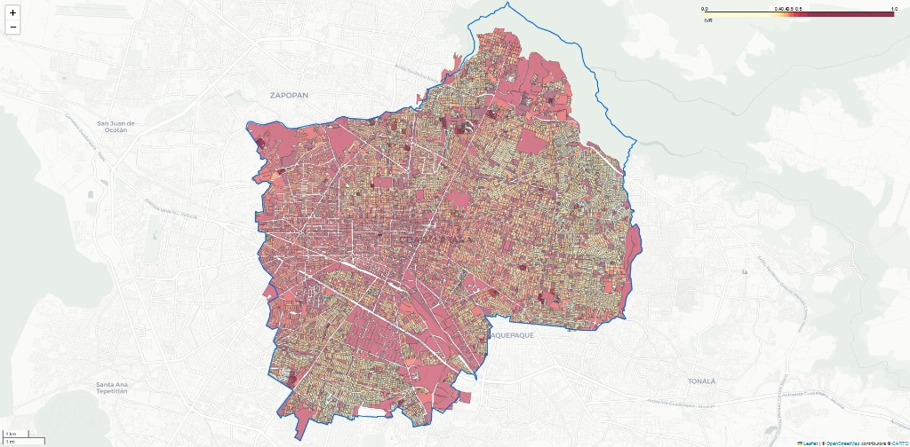

# IVR Guadalajara — Índice de Viabilidad para Redensificación

Herramientas en Python para identificar polígonos censales (por ejemplo **manzanas** o **AGEBs**) en **Guadalajara, Jalisco**, con **alta densidad de servicios urbanos** (hospitales, escuelas, mercados, transporte público según OpenStreetMap) y **baja densidad de población** respecto al área, útil como apoyo exploratorio para análisis de redensificación.



*Captura del mapa HTML generado por el proyecto (leyenda 0–1, colores por cuantiles).*

## Cómo funciona (resumen)

1. **Entrada:** un archivo vectorial (Shapefile o GeoPackage) con polígonos y la columna **`POBTOT`** (población total, Censo 2020 / ITER u otra fuente compatible).
2. **Límite municipal:** se obtiene el contorno de Guadalajara vía geocodificación (**OSMnx** / Nominatim).
3. **POIs:** se descargan puntos de interés de **OpenStreetMap** dentro de ese contorno (`amenity`: hospital, school, marketplace; `public_transport`: platform, station, stop_position).
4. **Cruce espacial:** por cada polígono se cuentan los POIs **dentro** del polígono (`geopandas.sjoin`, predicado `within`).
5. **Densidades:** población por km² y POIs por km² (áreas en CRS métrico **EPSG:32613**).
6. **Outliers:** antes de normalizar, las densidades se **winsorizan** por arriba al percentil configurable (por defecto **98%**), para que mercados o hospitales con muchísimos nodos OSM no aplasten la escala.
7. **Índice:** cada densidad se lleva a \[0, 1\] con **MinMaxScaler** sobre los valores winsorizados; **IVR** = diferencia reescalada a \[0, 1\] (más servicios normalizado y menos población normalizado → IVR más alto).
8. **Salida:** mapa interactivo **HTML** (Folium / `geopandas.explore`) con colores por **cuantiles** (**`Quantiles`, k=10**), de modo que haya contraste visual entre zonas aunque la distribución del IVR esté sesgada.

## Requisitos

- **Python 3.10+** recomendado.
- **Conexión a internet** la primera vez (descarga de límite y POIs OSM).
- Archivo con **`POBTOT`** y geometrías **poligonales** (`Polygon` / `MultiPolygon`).

### Datos sugeridos

- **INEGI:** Marco Geoestadístico / ITER (manzanas o AGEBs) con población.  
  [Marco Geoestadístico](https://www.inegi.org.mx/temas/mg/) · [Censo de Población y Vivienda 2020](https://www.inegi.org.mx/programas/ccpv/2020/)
- **OpenStreetMap:** usado automáticamente por **OSMnx** (Overpass / Nominatim).

En GeoPackage con **varias capas**, si `geopandas` no elige la correcta, conviene exportar una sola capa o indicar la capa al leer datos (extensión futura posible).

## Instalación

```bash
git clone <url-de-tu-repositorio>.git
cd Proyecto
python -m venv .venv

# Windows
.\.venv\Scripts\activate

pip install -r requirements.txt
```

> En **Windows**, si `pip install geopandas` falla por GDAL/Fiona, suele ser más estable usar **conda-forge**:  
> `conda install -c conda-forge geopandas osmnx folium matplotlib mapclassify scikit-learn`

## Uso

### Línea de comandos

```bash
python ivr_guadalajara.py --shp-path "ruta\a\tus_datos.gpkg" --output-html mapa_ivr_guadalajara.html
```

Opciones útiles:

| Opción | Descripción |
|--------|-------------|
| `--output-csv archivo.csv` | Exporta tabla sin geometría. |
| `--output-gpkg resultado.gpkg` | Exporta resultados con geometría y columnas del IVR. |
| `--no-boundary-filter` | No recorta polígonos por intersección con el límite OSM de Guadalajara. |
| `--winsor-quantile 0.95` | Percentil superior para winsorización (por defecto `0.98`). |
| `--map-scheme Quantiles` | Esquema **mapclassify** para el mapa (por defecto `Quantiles`). |
| `--map-k 10` | Número de clases en la leyenda (por defecto 10 ≈ deciles). |

### Interfaz gráfica (tkinter)

```bash
python ivr_guadalajara_gui.py
```

Selecciona el vectorial de entrada, revisa rutas de salida (HTML, CSV opcional, GPKG opcional) y pulsa **Calcular IVR y generar mapa**. Al terminar puedes abrir el HTML en el navegador.

## Estructura del repositorio

| Archivo | Rol |
|---------|-----|
| `ivr_guadalajara.py` | Lógica del IVR, CLI y exportación. |
| `ivr_guadalajara_gui.py` | Ventana simple para elegir archivos y ejecutar el pipeline. |
| `requirements.txt` | Dependencias Python. |
| `docs/mapa_ivr_preview.png` | Ejemplo visual para el README. |

## Limitaciones y buenas prácticas

- Los **POIs OSM** dependen del mapeo comunitario; no sustituyen un catastro oficial de equipamiento.
- **Municipio vs. metrópoli:** el límite geocodificado como “Guadalajara” puede no coincidir exactamente con el recorte INEGI que uses; revisa coherencia espacial.
- **Muchos polígonos** (cientos de miles) aumentan tiempo y memoria en el *spatial join*; conviene **recortar** previamente a la zona de estudio en QGIS o similar.

## Licencia

Especifica aquí la licencia de tu repositorio (por ejemplo MIT, CC-BY, etc.) según lo acuerdes para el seminario o la institución.
